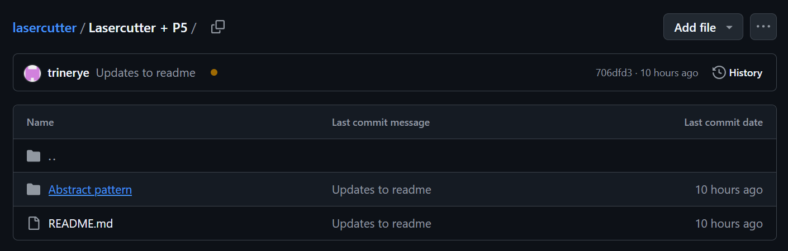
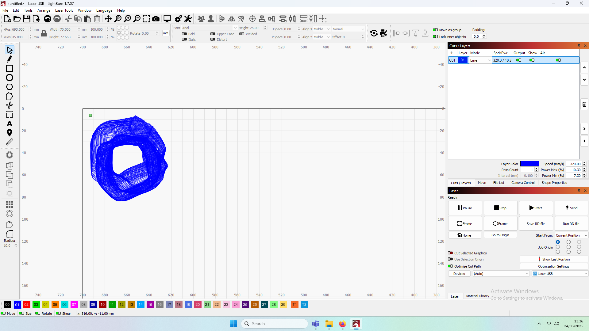
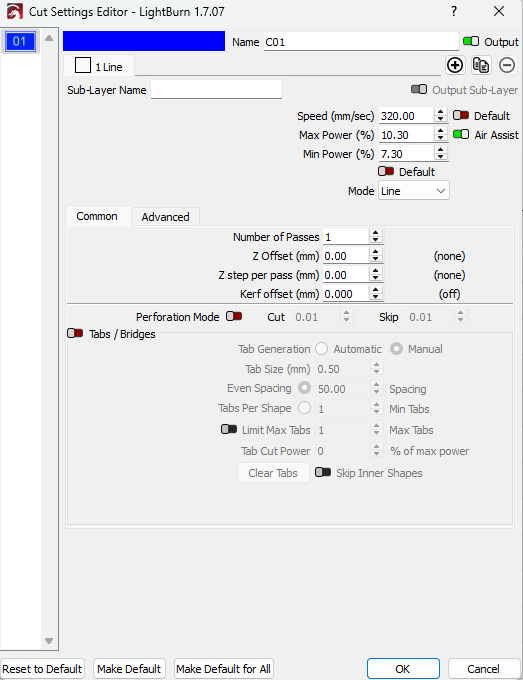

# Laserskær Generativ Kunst med P5.js

<!-- <p align="center">  </p> -->

## Indhold

- [Inden du går i gang](#inden-du-går-i-gang)
- [Generer dit kunstværk med P5.js](#generer-dit-kunstværk-med-p5js)
  - [Metode 1: Lav dit eget kunstværk](#metode-1-lav-dit-eget-kunstværk)
  - [Metode 2: Download et eksempel](#metode-2-download-et-eksempel)
- [Importer dit kunstværk til Lightburn](#importer-dit-kunstværk-til-lightburn)
- [Vælg de rigtige skæreindstillinger](#vælg-de-rigtige-skæreindstillinger)
- [Laserskær dit kunstværk](#laserskær-dit-kunstværk)


## 🛠️ Inden du går i gang

Før du begynder at laserskære, skal du:

- Læse den [officielle guide](../README.md#brug-af-lasercutteren-i-dd-lab) til hvordan du anvender lab'ets lasercutter.
  <br>

- Have et gyldigt kørekort til laserskæreren. Hvis du ikke har dette, kan du henvende dig til en af lab'ets ansatte og bede om hjælp til at laserskære.


## 🎨 Generer dit kunstværk med P5.js

#### ✏️ *Metode 1: Lav dit eget kunstværk*

For at kunne laserskære dit P5.js-kunstværk skal du gemme det som en PNG eller SVG. Følg disse trin:

1. Åbn Visual Studio Code.
   <br>
2. Opret en `index.html`-fil med de korrekte **P5** og **SVG** biblioteker.

   ```html
   <!DOCTYPE html>
   <html lang="da">
     <head>
       <script src="https://cdnjs.cloudflare.com/ajax/libs/p5.js/1.4.1/p5.js"></script>
       <script src="https://cdnjs.cloudflare.com/ajax/libs/p5.js/1.4.1/addons/p5.sound.min.js"></script>
       <script src="https://unpkg.com/p5.js-svg@1.3.1"></script>
       <link rel="stylesheet" type="text/css" href="style.css" />
       <meta charset="utf-8" />
     </head>
     <body>
       <main></main>
       <script src="sketch.js"></script>
     </body>
   </html>
   ```
   <br>
3. Opret en `sketch.js`-fil der gemmer dit kunstværk som en SVG-fil.

   ```javascript
   function setup() {
     createCanvas(windowWidth, windowHeight, SVG);
   }

   function draw() {
     // Skriv din generative kode her
   }

   function keyReleased() {
     if (key == "s" || key == "S") save("drawing.svg"); // Kan ændres til .png
   }
   ```
   <br>
4. Klik på ***"Go Live"*** i Visual Studio Code for at åbne koden i din browser *(kræver Live Server-plugin)*.

   <br>

5. Tryk på ***"S"*** for at gemme kunstværket som en SVG-fil.


#### 📥 *Metode 2: Download et eksempel

1. Opret en projektmappe på din computer.
    <br>
2. Åben ***Abstract Pattern*** mappen, download filerne og placer dem i den nye mappe du lige har lavet.

    <br>

4. Åbn projektet i Visual Studio Code
   - ***File*** → ***Open Folder*** → ***"navnet på din projektmappe"***.
    <br>
5. Klik på ***"Go Live"*** i Visual Studio Code for at åbne koden i din browser *(kræver Live Server-plugin).*

    <br>
6. Tryk på **"S"** for at gemme kunstværket som en SVG-fil.
    <br>


##  📂 Importer dit kunstværk til Lightburn

1. Åbn Lightburn og importer SVG-filen
   - ***File*** → ***Import*** → ***drawing.svg***.


## ⚙️ Vælg de rigtige skæreindstillinger

Skæreindstillingerne afhænger af dit materiale. Dette eksempel tager udgangspunkt i *standardindstillingerne* for finér. Hvis du bruger karton eller akryl, skal du justere indstillingerne herefter.

1. Marker kunstværket og tildel en farve.
    <br>
2. Gå til ***Cuts/Layers*** og angiv skæreindstillinger for farven.

    <br>

3. Hvis dit kunstværk har overlappende linjer ( f.eks. line-art):
   - Vælg ***Mode*** → ***Line***.
   - Dobbeltklik på ***Spd/Pwr*** for at justere laserens hastighed og styrke.
   - Sæt `Speed (mm/sec)= 320`, ``Max Power (%) = 10.30``, ``Min Power (%) = 7.30`` og tryk derefter ***OK***.
   <br>
   <p align="center">   </p>

   <br>
4. Hvis linjerne ***ikke*** overlapper hinanden:
   - Vælg en af de forudindstillet skæreindstilling:
     - Klik på farven under ***Cuts/Layers***.
     - Gå til ***Material Library*** → ***Plywood (Finer)*** → ***Engrave Line***.
     - Klik på ***Assign to Layer***.

## 🔥 Laserskær dit kunstværk 

Når alle indstillinger er på plads, er du klar til at laserskære!
