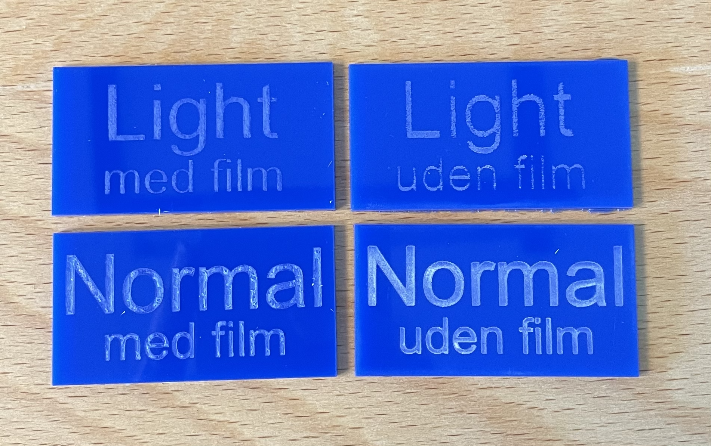
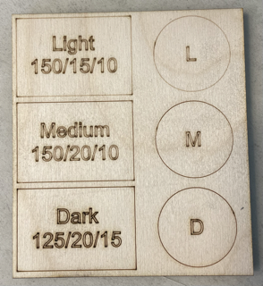

# Brug af Lasercutteren i DD Lab
Der er en række ting, man skal være opmærksom på ved brug af lasercutteren og dem kan du læse om lige her.  

For at få adgang til lasercutteren, skal du kontakte en ansat i DDLab, enten i åbningstiden eller på mail, og arrangere et kort introduktionskursus.

Det er kun tilladt at bruge lasercutteren til studierelevante aktiviteter. Skal du producere til egen virksomhed eller projekter ud over studiet, bedes du i stedet gøre brug af faciliteterne på [godsbanen](http://godsbanen.dk/godsbanens-aabne-vaerksteder/laser//).

## Indhold

- [Inden du går i gang](#inden-du-går-i-gang)
- [Materialer](#materialer)
- [Når du laver din fil](#når-du-laver-din-fil)
  - [Tegn din fil direkte i Lightburn](#tegn-din-fil-direkte-i-lightburn)
  - [Tegn din fil i et andet program](#tegn-din-fil-i-et-andet-program)
  - [Indstil farver](#indstil-farver)
  - [Indstil skæreindstillinger](#indstil-skæreindstillinger)
- [Når du skal skære](#når-du-skal-skære)
- [Vedligeholdelse af maskinen](#vedligeholdelse-af-maskinen)
- [Nyttige Links + Guides](#nyttige-links-+-guides)

## Inden du går i gang

Inden du går i gang, er her et par ting, der er smarte at huske på:  
- Lasercutteren har et effektivt skæreområde på 700x500mm. Der er plads til materialer op til 710x510mm. Er dit materiale større end dette, skal du have skåret det til inden. Brug evt. savene i grovlab'et. 
- Det er ikke muligt at reservere lasercutteren. Vær derfor ude i god tid når du skal skære, da maskinen kan være meget travl i perioder.  
- Når du skærer i akryl, så vent med at tage beskyttelsesfilmen af så længe som muligt, medmindre du skal gravere (se under [indstil skæreindstillinger](https://github.com/DDlabAU/lasercutter#indstil-skæreindstillinger)). Så bliver det pænere når du skærer og dit materiale bliver ikke så nemt ridset.
- Hvis du vil undgå røgmærker på dit træ, så tape overfladen med malertape, inden du skærer.  

*Hvis du gør dig egne erfaringer eller har tips, så giv dem meget gerne videre til medstuderende og DD Lab*

## Materialer
Det er kun tilladt at lasercutte materialer købt på [DDLabs webshop](ddlab.au.dk/webshop). Det er ikke noget lab'et tjener penge på, men er en måde for os at være sikre på, at der ikke bliver skåret i farlige materialer.

Som udgangspunkt sælges der træ og akryl. Har du et ønske om at skære andre materialer, kan du kontakte en ansat i åbningstiden eller på vores mail (ddlabau@gmail.com) og vi vil undersøge om det kan lade sig gøre.

Du betaler for materialerne på webshoppen og afhenter i lab'ets åbningstid. Du får tilsendt en kvittering på mail, som du skal kunne fremvises, hvis du bliver spurgt af en ansat.

Skal du købe en større mængde materialer på én gang så kom gerne forbi lab'et inden du betaler. Webshoppens beholdning er ikke altid 100% korrekt og på den måde kan vi være helt sikre på, at vi har alle de ønskede materialer inden du betaler.

Du finder webshoppen her: [ddlab.au.dk/webshop](http://ddlab.au.dk/webshop/)

## Når du laver din fil

Det eneste krav til filer der skal skæres er at de kan åbnes af programmet Lightburn. Når du skal lave din fil, har du flere muligheder i forhold til hvilke programmer du kan bruge.

#### Tegn din fil direkte i lightburn    
Der er installeret lightburn på computeren ved lasercutteren. Såfremt den ikke bruges til at skære eller fræse, kan du bruge den til at tegne din fil.  
Du kan også hente en _[prøve-version af lightburn](https://lightburnsoftware.com/pages/trial-version-try-before-you-buy)_ og tegne din fil hjemmefra. Hvis din prøve-periode er udløbbet, kan du kontakte en ansat i labbet for at få adgang til en licens.

#### Tegn din fil i et andet program  
En anden mulighed er at tegne filen i et andet program, som f.eks. Illustrator eller Inkscape, og importere den til lightburn.

Der er ikke nogen krav til hverken bestemte stregtykkelser eller farver i filen du skal importere. Alt det indstilles efter den er blevet importeret til lightburn.

Når du eksporterer din fil, skal du sørge for at gøre det til et af følgende filformat som lightburn kan importere:
* .ai - Adobe Illustrator
* .pdf - Adobe Portable Document Format
* .dxf - Drawing Exchange Format
* .svg - Scalable Vector Graphics
* .hpgl / .plt - Plotter vector graphics

#### Indstil farver
Når du er færdig med at tegne og har importeret din fil til lightburn, skal du indstille farverne på dit cut.

Farver i lightburn er en måde at adskille forskellige elementer der skal skæres og fungerer lidt ligesom lag i photoshop eller illustrator. Når en form bliver givet sin egen farve, har man mulighed for at arbejde med den form adskilt fra de andre og give den unikke skæreindstillinger. Giver du den samme farve til flere former vil de pågældende former dele indstillinger. Lagene der bliver dannet udfra farverne er også en måde at styre rækkefølgen af hvad der bliver skåret. Den farve der ligger øverst i oversigten af alle dine lag/farver (`Cuts/Layers`) er den der bliver skåret/graveret først og herefter er den det næste under, og så videre. Ønsker du at ændre på rækkefølgen kan du trække i farverne i listen af dine farver/lag.

Hvor mange farver du er nødt til at bruge afhænger helt af hvad du gerne vil skære. Har du et simpelt cut, hvor alle formerne skal skæres på samme måde, kan du nøjes med at bruge en enkelt farve til det hele.

Skal du derimod både gravere og skære dit materiale i samme omgang, er du nødt til at bruge én farve til de former du vil skære og en anden farve til de former du vil gravere. Her er det selvfølgeligt også muligt at bruge forskellige farver til at gravere specifikke former lysere eller mørkere.

Du indstiller farven på en form ved at markere formen og derefter klikke på en farve i bunden af vinduet. Når du har gjort det, vil du se din farve dukke op som et lag ude i højre side af vinduet.

#### Indstil skæreindstillinger
Når du har givet din fil de nødvendige farver skal du sørge for at alle farverne/lagene har den korrekte skæreindstilling. Hvad den er, vil afhænge af hvilket materiale du arbejder på, tykkelsen på materialet og hvilket type cut du gerne vil lave (gennemskæring eller gravering).

DDLab vedligeholder en samling af skæreindstillinger du kan bruge som udgangspunkt for dine egne indstillinger. På grund af slid af maskinen og små forskelle på materialerne der skæres, kan vi ikke garantere at indstillingerne skærer helt perfekt. Du bør derfor altid lave et mindre test-cut i dit materiale og derudfra justere indstillingerne så du opnår dit ønskede resultat.

Du finder indstillingerne nederst i højre side af vinduet under fanen `Library`. De er inddelt først i materialer, så i tykkelser. Graveringsindstillinger vil være under `Engrave` under det pågældende materiale. Der findes to niveauer af gravering, `Engrave normal` og `Engrave light`, alt efter hvor dybt/tydeligt du vil gravere i dit materiale. Der findes tre niveauer af gravering af linjer `Engrave Dark`, `Engrave normal` og `Engrave light`.

Hvis `Library`-fanen er forsvundet, kan du genaktivere den ved øverst i vinduet at trykke på `Window` og derefter sætte et flueben ud foran `Library`.

Du anvender skæreindstillingerne ved at markere den farve/det lag du vil indstille, så markerer du den ønskede indstilling og trykker på knappen `Assign to layer`.

Hvis du skal gravere i akryl kan du med fordel lægge siden uden film opad da filmen ellers vil smelte lidt ned i graveringen, især ved gravering med indstillingen `Engrave normal`. På billedet kan det ses hvordan graveringen vil se ud i de forskellige indstillinger og med/uden filmsiden opad. 

*Du kan også finde disse prøveskæringer i labbet ved siden af lasercutteren.*

Hvis du skal gravere en eller flere linjer kan du bruge `Engrave line` indstillingerne under `Engrave` for de forskellige materialer (lige nu er der kun graverings indstillinger for linje for finer). Herunder kan du se hvordan gravering vil se ud i de tre forskellige indstillinger vi har (light, medium og dark). 

*Du kan også finde disse prøveskæringer i labbet ved siden af lasercutteren.*

## Når du skal skære
Når lasercutteren er i brug **SKAL** maskinen være under opsyn, da der er risiko for, at der går ild i materialet. Det er altså ***ikke*** tilladt at forlade rummet imens maskinen er i gang med at skære.  

I rummet hvor lasercutteren står er der flere dyre og farlige maskiner. Opfør dig derfor forsigtigt og med respekt for maskinerne.

Når du skærer skal udsugningen **ALTID** være tændt. Du skal kun aktivere knapperne på selve maskinen, og du skal altså **ikke** indstille noget på den hvide boks til udsugningen i hjørnet af rummet. Udsugningen tændes på knappen **Fans** som altid skal tændes for, sammen med de andre knapper. Tjek altid at der lyser en grøn diode ud fra *Drift* på udsugningen på væggen efter du har tændt for **Fans**. Hvis den mod forventning ikke skulle lyse kontakt en ansat. 

Hvis der, mod forventning, skulle gå ild i dit materiale, stopper du først maskinen ved at trykke på den store røde nødstop-knap, så forsøger du først at slukke ilden med spraydåsen med kølespray, der står ved lasercutteren, og, hvis det ikke er muligt, så med ildslukkeren. Se også sikkerhedsinstruktionerne over maskinen. 

## Vedligeholdelse af maskinen
Det er kun DDLab-ansatte der må foretage vedligeholdelse af maskinen. Du bør derfor tage kontakt til en ansat, hvis du oplever problemer når du skal skære. Det kan du gøre personligt i lab'ets åbningstid eller på mail til ddlabau@gmail.com

## Nyttige Links + Guides

Hvis du skal bruge en kasse til din elektronik eller i forbindelse med dit projekt, så kan du bruge en online service til at generere tegningerne, så du ikke selv behøver at lave dem fra bunden. Du kan så efterfølgende rette tegningerne til i f.eks. Illustratur, Inkscape eller Lightburn. Vi har to favoritter som du kan prøve:

- [Boxes.py](https://www.festi.info/boxes.py/)
- [Makercase](http://www.makercase.com/)

Husk på at der er tale om gratis værktøjer der er under udvikling. Tjek derfor altid at målene er som forventet i forhold til din materialetykkelse, inden du skærer dem. 

### Guides

